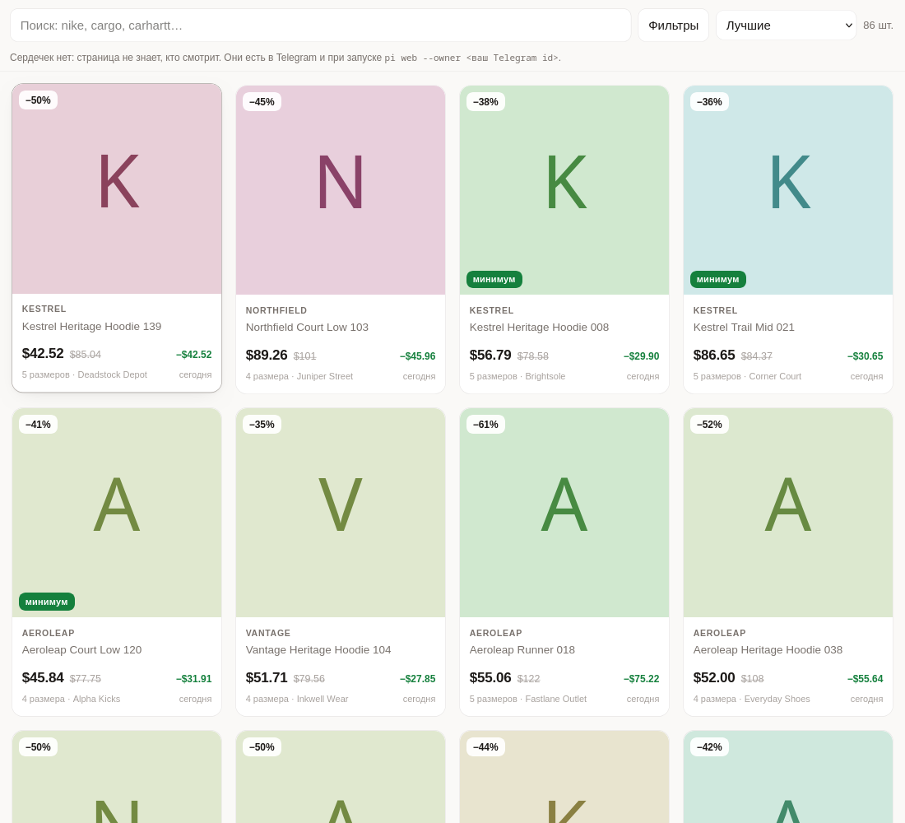
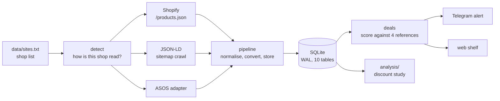

# Price Intelligence

[](https://github.com/Whyslab/price-intelligence/actions/workflows/ci.yml)


A price collector and discount checker for sneaker and streetwear shops. It reads **310 shops**
(181 readable), keeps a price history in SQLite, and answers one question that shops are not
eager to answer: **is this discount real?**

It was built as a Telegram alert bot, grew a web shelf and a subscription layer, and was paused
on 2026-09-30 after a 34-day crawl. This repository is the engineering and the data analysis
that came out of it.

| | |
|---|---|
| Crawled | 979,422 products · 4.65 M variants · 12.8 M price points · 310 shops |
| Code | ~14,700 lines of Python in `pi/`, 937 tests (no network), CI on Python 3.11 and 3.13 |
| Reads | Shopify `/products.json`, schema.org JSON-LD, one bespoke JSON API (ASOS) |
| Out | Telegram alerts with photos, a browser shelf, a CLI, a discount analysis |

## What the data says

For the full write-up with caveats, see **[docs/findings.md](docs/findings.md)**. The short
version:

* **91% of discounts of 10% or more** (1.34 M variants) carry a "was" price that was never
  charged in the 34-day window. That alone is weaker than it sounds: a tag already on at our first
  look cannot be checked against a price from before it.
* The cleaner cut is a product first seen *without* a tag that later gains one. There the "was"
  price matches a price the shop really charged **91% of the time** (84,402 variants), though
  that cut is thin: 58 shops, and one of them supplies 39% of it.
* The opposite cut: tags already on at first sight, on products watched for four weeks. The price
  reached them **5% of the time** (767,611 variants). That is a standing markdown or a list
  price, not a sale, and the label looks identical.
* Round discounts (20/30/40/50/60%) are **not** evidence on their own: a real "30% off
  everything" sale is round too. 32 of 87 analysed shops are round *and* never-charged
  (`round_unseen`). The data cannot say which way their arithmetic ran, so they are labelled by
  what is observed, not by intent.


## Try it in two minutes

No crawl, no Telegram token. The demo database is synthetic: ten fictional shops: two never show a tag, the other eight each plant one behaviour
(honest, round promotion, round and never charged, irregular and never charged).

```bash
git clone https://github.com/Whyslab/price-intelligence && cd price-intelligence
python -m venv .venv && source .venv/bin/activate
pip install -e ".[dev,analysis]"

python scripts/make_demo_db.py data/demo.db
export PI_DB_PATH=data/demo.db PI_FILTERS_FILE=filters.toml.example
python -m pi reshelve                 # score the shelf from the demo data
python -m pi web                      # http://127.0.0.1:8000
python analysis/discounts.py --db data/demo.db --out /tmp/demo-results
pytest -q                             # 937 tests, under a minute, no network
```

The shelf and bot messages are in Russian (the first user's language). Code and this
documentation are in English; the original long-form Russian manual is kept in
[docs/ru/README.md](docs/ru/README.md).



## How it works



A discount is judged against four references, in order of how hard they are to fake:

1. the **lowest price the shop itself charged in the last 30 days** (the EU 98/6/EC rule);
2. what **other shops** ask for the same article right now, matched by manufacturer style code;
3. the **recommended price** as the mode of many shops' struck-through prices;
4. the shop's own struck-through price — last, and only from a shop that has not disqualified
   itself.

## Engineering decisions worth reading

The places where the obvious design was wrong. Most are covered by a test; the one that is not
is marked.

* **Rate limit per platform, not per shop.** Shopify throttles by *client IP across all its
  shops*. In a measurement at the start of the project, parallel crawling lost 58 of 138 shops in
  one sweep, with no `Retry-After`. All Shopify requests now go through one shared limiter with a
  circuit breaker (`pi/throttle.py`). It reduces the damage and does not remove it: the quota is a
  rolling allowance that can run out within a run, which the module documents. *(The 58/138
  measurement is not reproduced by a test.)*
* **Currency comes from the storefront**, not from the domain: a `.com` in Berlin sells in
  euros. A currency the exchange table does not know drops the price instead of pricing it in
  dollars. A shop that reports no currency at all falls back to USD, which is a known weak spot.
* **A price point is written only when something changed**, judged in the shop's own currency.
  Judged in dollars, every daily exchange-rate tick looked like news and turned a currency
  wobble into an "all-time low". A consequence worth knowing when reading the data: the last point
  says when a price last changed, not when it was last looked at (the analysis uses
  `products.last_seen` for that).
* **"Reached the end" ≠ "read everything".** A pass resumed at page 40 that ran to the end must
  not mark pages 1–39 as withdrawn. Withdrawal needs an explicit `enumerated` flag that only a
  full first-page pass sets.
* **The alert is recorded before it is sent**, and deleted if sending fails, so a crash
  mid-send cannot produce a duplicate. The price of that guarantee is that such a crash loses the
  alert instead.
* **Adapters verify, they do not trust.** A bespoke adapter (ASOS) is checked by `detect`, so one
  that stops working looks like a broken shop, not a healthy one. The detection path is tested; the
  health-report path is not.

## Layout

```
pi/                 the collector, scorer, bot and web shelf
  sources/          shopify.py · jsonld.py · asos.py · detect.py
analysis/           discounts.py + committed results (summary.json, stores.csv, charts)
scripts/            make_demo_db.py (synthetic data) · install-units.sh · tunnel.sh
tests/              937 tests, every outbound request mocked
docs/               findings.md · product.md · function-map.md · subscription.md · ru/
systemd/            timers and services (hourly sweep, daily digest, backup, prune)
```

## Limitations

Honest list, because a portfolio piece that hides them is worse than one that shows them.

* **34 days of history.** Long enough to find patterns, too short to call any shop dishonest.
* **181 of 310 shops are readable.** Of the rest, some render prices in JavaScript with nothing
  in the markup, some refuse even a browser fingerprint, some are dead. They are marked
  (`blocked`, `tls`, `dead`, `unknown`) instead of silently returning zero products.
* **No Norwegian shops**, and no landed-cost model for Norwegian VAT and duty beyond the optional
  `shipping.toml`.
* **Collection is paused**, so the live shelf and bot are off. The code, tests and the analysis
  work; the data in `analysis/results/` is from the last crawl. The 3.2 GB database is not in the
  repository.
* **Name matching is by style code.** It cannot tell a pre-owned pair from a new one, so a
  cross-shop price gap is partly noise (see findings).
* **The Telegram subscription layer** (Stars payments, paywall, admin panel) is implemented and
  tested but was never switched on, and no one has paid for it.
* **UI text is Russian only.**

## Data and ethics

* The crawler reads public catalogue endpoints (`/products.json`, product pages, sitemaps) with
  a global rate limit shared by all shops on a platform. It does not log in and does not resell
  data. The User-Agent carries this repository's URL so a shop can reach the author; a domain
  put in `data/excluded.txt` is dropped from every code path.
* Two things I would flag to a reviewer. First, `robots.txt` is read only to discover sitemaps;
  its `Disallow` rules are **not** honoured. Second, the optional `impersonate` extra presents a
  browser's TLS fingerprint to shops that answer 403 to everything else. That works around a block
  the shop put up on purpose. It is off unless you install the extra, and I would not enable it
  against a shop that has said no.
* The repository holds no crawled data. The demo database is synthetic, and `analysis/results/`
  contains only per-shop aggregates (counts and shares). `data/sites.txt` is a list of public
  storefront domains. If you run one of them and want it removed from the list or the results,
  open an issue.

## Documentation

* [docs/findings.md](docs/findings.md) — the discount study
* [docs/product.md](docs/product.md) — what it is for and what was next
* [docs/function-map.md](docs/function-map.md) — every CLI command and route, with how to check it
* [docs/ru/README.md](docs/ru/README.md) — the full original manual, in Russian

## License

[MIT](LICENSE)
