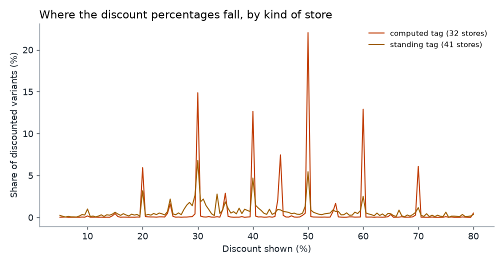
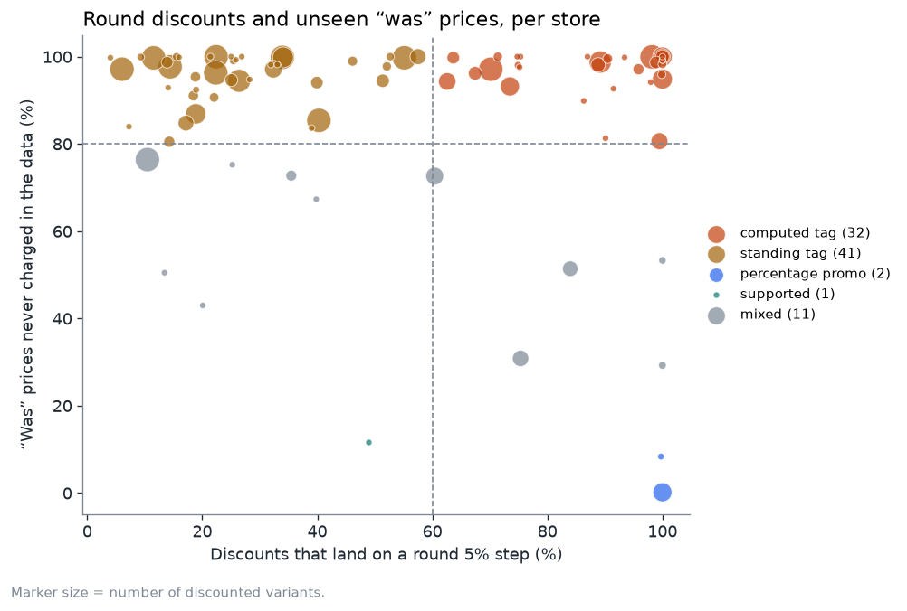

# Struck-through prices: what 12.8 million price points show

*Data: 310 sneaker and streetwear shops, 34 days (24 Aug – 27 Sep 2026). Everything here is
reproducible with [`analysis/discounts.py`](../analysis/discounts.py); the numbers below are
copied from [`analysis/results/summary.json`](../analysis/results/summary.json) and the
per-shop table is [`stores.csv`](../analysis/results/stores.csv).*

## The question

A shop shows `$164` next to a struck-through `$301`. Was it ever `$301`?

Price Intelligence records every price a shop shows, so it can ask that question of the data
instead of the label. A "was" price is **seen** if the same variant was charged at least 95% of
it at some point in the data. Otherwise it is **unseen**. *Unseen is not the same as false*: the
number may be a manufacturer's list price, or the shop may have charged it before the first
observation. The point of the analysis is to find out how far that caveat stretches.

## The headline number is the weakest one

> 1,353,434 variants wore a discount. For 90.3% of them the "was" price was never charged
> in the data.

That figure is real and I do not trust it. It is dominated by shops that put a tag on a product
**before our first look**, and for those a price from before the window can never be seen. So I
cut the same data three more ways, each answering the weakness of the last.

| Cut | Variants | "Was" price unseen | What it can and cannot say |
|---|---:|---:|---|
| All discounted variants | 1,353,434 | 90.3% | Biggest sample; overstates, because the past is invisible |
| Watched ≥ 28 days | 82,589 | 67.8% | Fairer, but only variants that stay listed that long |
| **First seen without a tag** | 74,419 | **5.1%** | The price before the tag was observed — the cleanest test |
| **Tagged from the start, watched ≥ 28 days** | 75,157 | **74.4%** | The tag stood for the whole window and the price never reached it |

The two bold rows tell the story, and they point in opposite directions.

* **When a tag appears on a product we had seen at full price, it is almost always honest.**
  In 94.9% of 74,419 cases the "was" price matches a price the shop really charged. Shops mostly
  do not invent a sale after the fact.
* **When a tag is already there on first sight and stays for four weeks, the price usually never
  gets near it** (74.4% of 75,157). That is a standing markdown rather than a sale, or a list
  price used as a reference. Both are common and in some jurisdictions legal. It is a different
  thing from a sale, and the label does not say which one you are looking at.

I had first read the 90% figure as "most discounts are fake". The fresh-tag cut says that is not
what the data supports.

## Round percentages are not the evidence

Some shops show nothing but 20%, 30%, 40%, 50%, 60% off. That looks like a rule — *"−40% on
everything"* — and the "was" price looks computed backwards from the sale price.

But a real "30% off sitewide" sale is round too, and its "was" price is genuine. Round alone
proves nothing. Round **and** unseen together is the signature of a computed tag, so each shop
with at least 200 discounted variants (87 of them) is placed on two axes:

| Kind of shop | Shops | Discounted variants |
|---|---:|---:|
| Computed tag — round steps, "was" never charged | 32 | 351,391 |
| Standing tag — irregular percentages, "was" never charged | 41 | 754,617 |
| Percentage promotion — round steps, "was" was charged | 2 | 21,418 |
| Supported — irregular percentages, "was" was charged | 1 | 1,261 |
| In between | 11 | 223,818 |

The median shop has 97% of its "was" prices unseen and 51% of its discounts on a round step. Two
shops sit at the round-and-seen corner: a real promotion looks round but passes the second test,
so the pair of tests can tell the two cases apart. Two is a small number, and I would not build
on it. The control window — the same width placed half a step
away — catches about 1% of discounts for the median shop, so round steps are not a chance
pattern.

## Prices move less than the shelf suggests

72% of variants (3,363,404 of 4,654,930) were read exactly once: their price did not change in
34 days, so the shop never wrote a second point. Of the 861,368 variants with three or more
points, 183,893 moved by more than 5% and 128,165 by more than 20%. Most of the catalogue is
standing still; a small part moves a lot.

## What I could not conclude

* **Cross-shop price spreads.** 23,864 articles (by manufacturer style code) appear in two or
  more shops, 11,191 in three or more, so a comparison is possible. My first pass found a median
  gap of 1.7× between the cheapest and dearest shop. It collapsed once I excluded pre-owned
  pairs, resale prices, stale rows and different sizes, leaving 30 comparable articles — too few
  to say anything. The analysis reports coverage only.
* **Anything beyond 34 days.** The window is short, and a longer one would turn "unseen" into a
  firmer statement for the standing tags.
* **Intent.** A number never charged is a fact about the data. Why the shop shows it is not.
* **Norway.** No shop here is Norwegian. Nine of them quote NOK to a Norwegian visitor, but they
  are foreign shops with foreign delivery and duty; the prices a Norwegian pays are different.

## How it was checked

* The unseen test ran against the shop's own currency, not dollars, so exchange-rate ticks cannot
  move a price (the collector avoids the same trap, see `db.record_price`).
* I read raw histories for a few "unseen" variants. One example: an adidas model shown at €150 for
  the full 32 days while its price went €90 → €83. The test is doing what it says.
* The first cut of the cross-shop comparison was wrong, and I found that by opening the top
  entries and seeing pre-owned Travis Scott pairs next to retail ones.
* The same script runs on a synthetic database with four planted shop behaviours and recovers
  all four (`tests/test_analysis.py`).
